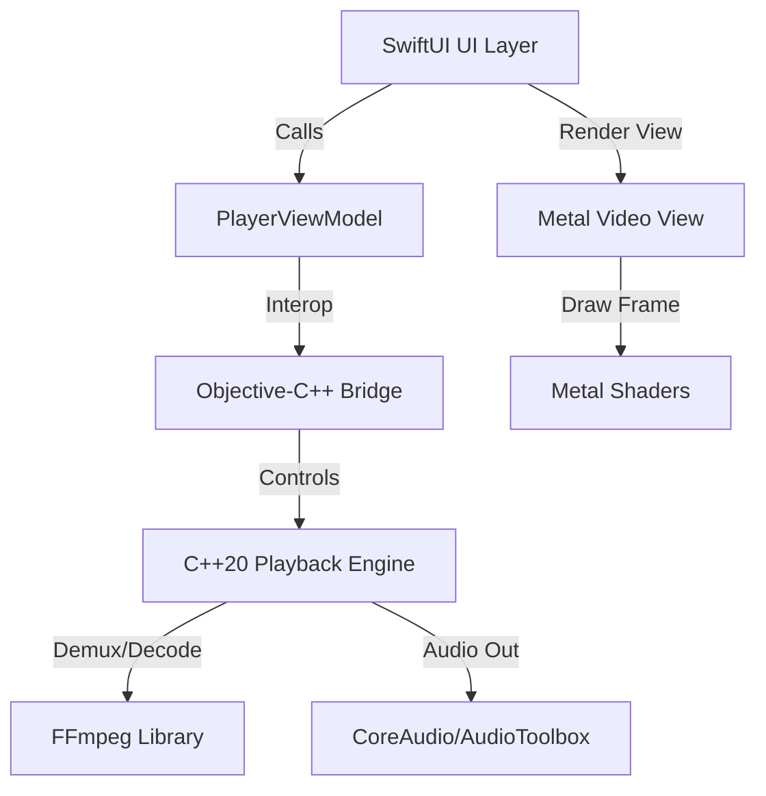

# RavPlayer

RavPlayer is a high-performance, lightweight media player designed with a C++20 core playback engine, a native macOS Swift interface, and GPU-accelerated Metal rendering.

> [!IMPORTANT]
> **Platform Support:** Currently, only **macOS** is developed and supported.

---

## Features

- **C++20 Playback Engine:** Highly optimized core logic managing packet queues, demuxing, decoding, and synchronized audio/video loops.
- **FFmpeg Integration:** Powered by FFmpeg libraries (`libavformat`, `libavcodec`, `libavutil`, `libswscale`, `libswresample`) for broad media format support.
- **Native macOS Interface:** Sleek SwiftUI-based interface featuring custom seek bars, layout options, and media controls.
- **Metal Rendering:** GPU-accelerated video rendering using native Metal APIs and custom shaders for low CPU overhead.
- **Low Latency Audio:** Native audio output driving synchronization using CoreAudio and AudioToolbox.
- **Interactive Playlist & Shortcuts:** Supports list-based queuing, key binding management, and smooth playback actions.

---

## Prerequisites (macOS)

Ensure you have the following installed on your Mac before building the project:

1. **Xcode Command Line Tools:** Install them by running:
   ```bash
   xcode-select --install
   ```
2. **Homebrew:** If not installed, get it from [brew.sh](https://brew.sh).
3. **CMake & FFmpeg:** Install using Homebrew:
   ```bash
   brew install cmake ffmpeg
   ```

---

## Setup & Build Instructions

Follow these step-by-step instructions to compile and build the player:

### Step 1: Run the macOS Build Script
The project includes a unified build script that configures the CMake workspace, compiles Metal shaders, builds the Objective-C++ bridge, and compiles the Swift application.

Run the build script from the root directory:
```bash
./platform/macos/build.sh
```

### Step 2: Launch the Application
Once the build is complete, you can find the application bundle at `platform/macos/rav_player.app`. Launch it using the terminal:
```bash
open platform/macos/rav_player.app
```
Alternatively, double-click the `rav_player.app` file in Finder.

---

## Running Tests

RavPlayer uses **Google Test** for unit and integration testing. To build and execute the tests, follow these steps:

1. Configure CMake with tests enabled:
   ```bash
   cmake -B build -S . -DBUILD_TESTS=ON
   ```
2. Build the project targets and test suites:
   ```bash
   cmake --build build
   ```
3. Run the tests using `ctest`:
   ```bash
   cd build && ctest --output-on-failure
   ```

---

## Architecture Overview



- **`engine/`**: The core, framework-agnostic playback engine managing media decoding (FFmpeg), packet streaming, subtitle handling, and render loops.
- **`platform/macos/`**: The macOS host application.
  - **`rav_player/`**: Swift application frontend, view models, and UI components.
  - **`bridge/`**: Objective-C++ bridge (`PlayerBridge.mm`) providing interface mappings between C++ objects and Swift.
- **`tests/`**: Automated Google Test cases verifying core engine modules.

---

## License

This project is licensed under the MIT License - see the [LICENSE](LICENSE) file for details.

